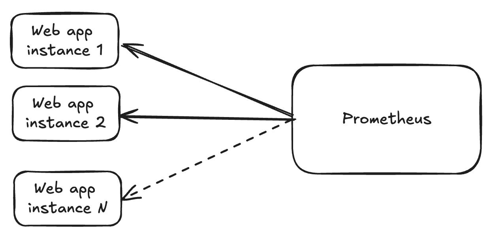
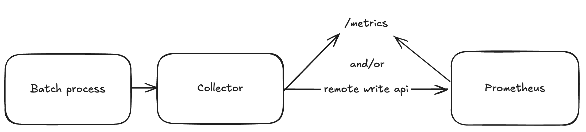
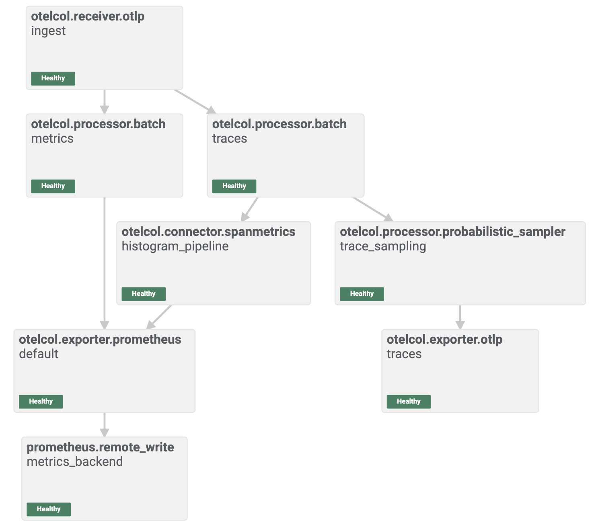

# Evolving Python Script Monitoring with OpenTelemetry and Prometheus

Modern application monitoring requires flexible solutions that adapt to various deployment patterns and provide deep visibility into system behavior [^1_1][^1_2]. This blog post demonstrates how to gradually improve Python script monitoring using OpenTelemetry and Prometheus, from basic web service monitoring to advanced observability.



Traditional web service monitoring with Prometheus

## 1. Traditional Web Service Monitoring with Prometheus Pull Model

The traditional approach to monitoring relies on Prometheus's pull-based architecture, where the monitoring server actively scrapes metrics from endpoints at regular intervals. This pull model is the foundation of Prometheus monitoring and works well for long-running web services.

### How the Pull Model Works

In this model, applications expose metrics through HTTP endpoints (typically `/metrics`), and Prometheus periodically scrapes these endpoints to collect data. The Prometheus server then stores these metrics and makes them available for querying and alerting.

### Python Fastapi Example with Prometheus Metrics

Below is a simple example of a Fastapi application instrumented with Prometheus metrics:

```python
import uvicorn
from fastapi import FastAPI
from prometheus_fastapi_instrumentator import Instrumentator

app = FastAPI()
Instrumentator().instrument(app).expose(app)

@app.get("/")
async def home():
    return {"message": "Hello World"}

if __name__ == "__main__":
    uvicorn.run("web-service:app", host="0.0.0.0", port=8000)
```

This code creates a basic web service that exposes full lifecycle metrics which Prometheus can scrape. The middleware automatically adds a `/metrics` endpoint that formats data in the Prometheus exposition format.

### Benefits and Limitations

**Benefits:**

- Simple configuration and setup
- Centralized control over scraping intervals
- Built-in service discovery capabilities

**Limitations:**

- Requires applications to run HTTP servers
- Not suitable for short-lived processes
- Batch jobs and ephemeral processes cannot be monitored effectively


## 2. Push Model for Batch Processes with OpenTelemetry Collector

Not all applications are web applications that can maintain persistent HTTP endpoints [^1_7][^1_12]. Batch processes, scheduled jobs, and ephemeral containers pose unique monitoring challenges that the traditional pull model cannot address effectively.

### The Challenge with Pull Model for Batch Processes

Batch processes present monitoring challenges because they:

- Run for limited periods and then terminate
- Have no persistent HTTP server to scrape
- May run behind firewalls or in isolated environments
- Need to export metrics before the process ends



Push model for batch process monitoring with OTEL collector

### OpenTelemetry Collector Solution

The OpenTelemetry Collector acts as a centralized agent that can receive metrics via push, then either expose them to Prometheus endpoints or forward them to remote write interfaces. This approach bridges the gap between ephemeral processes and monitoring systems.

### Python Batch Process Example

Here's how to instrument a batch process with OpenTelemetry metrics:

```python
import logging
import random
import time

from opentelemetry import metrics
from opentelemetry.exporter.otlp.proto.grpc.metric_exporter import \
    OTLPMetricExporter
from opentelemetry.sdk.metrics import MeterProvider
from opentelemetry.sdk.metrics.export import PeriodicExportingMetricReader
from pythonjsonlogger.json import JsonFormatter

logger = logging.getLogger()
logger.setLevel(logging.INFO)
handler = logging.StreamHandler()
handler.setFormatter(JsonFormatter())
logger.addHandler(handler)

# Set up the OTLP exporter and metric reader
exporter = OTLPMetricExporter(insecure=True)
reader = PeriodicExportingMetricReader(exporter)
provider = MeterProvider(metric_readers=[reader])
metrics.set_meter_provider(provider)

# Create meter and instruments
meter = metrics.get_meter(__name__)
duration_histogram = meter.create_histogram(
    name="duration",
    unit="ms",
    description="Duration of process"
)
error_counter = meter.create_counter(
    name="error_count",
    unit="1",
    description="Number of errors"
)

class HistrogramTimer:
    def __init__(self, duration_histogram, error_counter,  attributes={}):
        self.duration_histogram = duration_histogram
        self.error_counter = error_counter
        self.attributes = attributes or {}
    
    def __enter__(self):
        self.start_time = time.perf_counter()
        return self
    
    def __exit__(self, exc_type, exc_value, exc_tb):
        duration_ms = (time.perf_counter() - self.start_time) * 1000
        try:
            if random.random() < 0.05:
                raise Exception('simulated error')
        except Exception as e:
            self.error_counter.add(1, self.attributes)
            logging.error('transaction failed')
        duration_histogram.record(duration_ms, self.attributes)
        
if __name__ == "__main__":
    for i in range(50):
        with HistrogramTimer(duration_histogram, error_counter, {'op': 'data-process'}):
            time.sleep(random.uniform(100, 2000) / 1000)
    # Flush any remaining metrics before exit
    provider.shutdown()
```

This code demonstrates how a batch process can actively push metrics to an OpenTelemetry collector before terminating. The metrics are then available in Prometheus format or can be sent to remote write endpoints.

### Advantages of the Push Model

The push model provides several advantages for batch processes:

- Works with ephemeral and batch processes
- No need for persistent HTTP servers
- Flexible routing through collectors
- Better suited for containerized environments
- Can aggregate metrics from multiple sources

The metrics model for batch will work well for something like a cron job. But using metrics for dynamic services introduces a new set of issues.

- Prometheus cannot capacity plan the scrape targets
- The developer should handle the dynamic naming
- Complex aggregations


## 3. Advanced Tracing and Histogram Generation

While metrics provide valuable insights, distributed tracing offers unparalleled visibility into request flows and system behavior. OpenTelemetry's tracing capabilities allow us to generate histograms directly from trace data, providing an efficient way to monitor an unknown number of processes.

### The Power of Trace-Based Metrics

Traditional monitoring requires pre-defining metrics and their dimensions. Trace-based monitoring allows you to:

- Automatically track every operation without pre-configuration
- Generate metrics from trace spans post-collection
- Adapt to changing system architectures dynamically
- Provide both high-level aggregations and detailed request flows



Generating histograms from trace spans for efficient monitoring

### Python Tracing Example

Here's how to implement distributed tracing in a Python application:

```python
import logging
import random
import time

from opentelemetry import trace
from opentelemetry.exporter.otlp.proto.grpc.trace_exporter import \
    OTLPSpanExporter
from opentelemetry.sdk.trace import TracerProvider
from opentelemetry.sdk.trace.export import BatchSpanProcessor
from pythonjsonlogger.json import JsonFormatter

logger = logging.getLogger()
logger.setLevel(logging.INFO)
handler = logging.StreamHandler()
handler.setFormatter(JsonFormatter())
logger.addHandler(handler)

# Set up the OTLP exporter and span processor
exporter = OTLPSpanExporter(insecure=True)
provider = TracerProvider()
processor = BatchSpanProcessor(exporter)
provider.add_span_processor(processor)
trace.set_tracer_provider(provider)
tracer = trace.get_tracer(__name__)

class SpanTime:
    def __init__(self, name, attributes={}):
        self.name = name
        self.attributes = attributes or {}
    
    def __enter__(self):
        self.start_time = time.perf_counter()
        return self
    
    def __exit__(self, exc_type, exc_value, exc_tb):
        duration_ms = (time.perf_counter() - self.start_time) * 1000
        with tracer.start_as_current_span(self.name) as span:
            try:
                if random.random() < 0.05:
                    raise Exception('simulated error')
                span.set_attribute('duration', duration_ms)
                span.set_status(trace.Status(trace.StatusCode.OK))
            except Exception as e:
                span.record_exception(e)
                span.set_status(trace.Status(trace.StatusCode.ERROR))
                logging.error('failed transaction')

if __name__ == "__main__":
    for i in range(50):
        with SpanTime('data-process'):
            time.sleep(random.uniform(100, 2000) / 1000)
    # Flush any remaining metrics before exit
    provider.shutdown()
```

This example creates spans for different stages of order processing, allowing for detailed monitoring of each step [^1_19][^1_24]. These spans can later be aggregated into histogram metrics.

### Histogram Generation from Traces

OpenTelemetry processors can automatically generate histograms from span durations:

```
otelcol.connector.spanmetrics "histogram_pipeline" { 
  histogram {explicit {buckets = ["250ms", "500ms", "750ms", "1s", "3s"]}}
  metrics_flush_interval = "15s"
  output {metrics = [otelcol.exporter.prometheus.default.input]}
}
```

[The full config can be found here.](config/config.alloy)

This configuration transforms trace spans into histogram metrics that can be queried and alerted on using Prometheus. This approach is especially powerful for monitoring systems with variable numbers of components or microservices.

## 4. Alerting and SLO Tracking Based on Span Success Ratios

The ultimate goal of monitoring is to ensure service reliability and user satisfaction. Service Level Objectives (SLOs) based on trace data provide the most accurate representation of user experience while simple alerting ensures timelly responses from the service operators.

If you have configured the system properly you should be able to find this list of samples in prometheus.

```promql
traces_span_metrics_calls_total
traces_span_metrics_duration_milliseconds_bucket
traces_span_metrics_duration_milliseconds_count
traces_span_metrics_duration_milliseconds_sum
```

Lets explore the insights we can achieve with this group of samples.

### Service Operation Alerting Strategy
```promql
sum(rate(traces_span_metrics_calls_total{status_code="STATUS_CODE_ERROR"}[5m]))
```

### SLO-Based Alerting Strategy

Instead of alerting on individual metrics thresholds, SLO-based alerting focuses on:

- **Error Budget**: How much unreliability you can afford
- **Burn Rate**: How quickly you're consuming error budget
- **User Impact**: Alerts based on actual user experience


SLO monitoring dashboard with error budget and burn rate

### Implementing Span-Based SLIs

Service Level Indicators (SLIs) can be calculated directly from span success/failure ratios [^1_28][^1_25]:

```promql
# Success rate SLI
sum(rate(traces_span_metrics_calls_total{status_code!="STATUS_CODE_ERROR"}[5m])) / 
sum(rate(traces_span_metrics_calls_total[5m]))

# Error rate SLI  
sum(rate(traces_span_metrics_calls_total{status_code="STATUS_CODE_ERROR"}[5m])) / 
sum(rate(traces_span_metrics_calls_total[5m]))
```

These queries provide a clear measure of service health based on the ratio of successful spans to total spans [^1_28][^1_25]. This approach allows for precise SLO monitoring across distributed systems [^1_27].

### Advanced Alerting Rules

Here are sophisticated alerting rules based on error budget burn rates [^1_26][^1_27]:

```yaml
groups:
- name: slo_alerts
  rules:
  - alert: HighErrorRate
    expr: |
      (
        sum(rate(traces_span_metrics_calls_total{status_code="STATUS_CODE_ERROR"}[5m])) /
        sum(rate(traces_span_metrics_calls_total[5m]))
      ) > 0.05
    for: 2m
    labels:
      severity: warning
    annotations:
      summary: "Error rate exceeds SLO threshold"
      description: "Error rate is {{ $value | humanizePercentage }} which exceeds our 95% SLO"
      
  - alert: ErrorBudgetBurnRateHigh
    expr: |
      (
        sum(rate(traces_span_metrics_calls_total{status_code="STATUS_CODE_ERROR"}[1h])) /
        sum(rate(traces_span_metrics_calls_total[1h]))
      ) > (0.05 * 14.4)  # 14.4x burn rate means budget exhausted in 2 hours
    for: 5m
    labels:
      severity: critical
```

These alerts trigger when error rates exceed thresholds or when the error budget is being consumed too quickly. This approach ensures that teams are notified about issues that genuinely impact users.

### SLO Implementation Best Practices

1. **Choose Meaningful SLIs**: Focus on user-facing metrics
2. **Set Realistic SLOs**: Based on business requirements and current performance
3. **Implement Error Budgets**: Allow for controlled unreliability
4. **Use Burn Rate Alerting**: Alert on trend rather than point-in-time values
5. **Regular SLO Reviews**: Adjust targets based on business needs

## Conclusion

The evolution from traditional Prometheus pull-based monitoring to advanced OpenTelemetry observability represents a significant improvement in monitoring capabilities:

1. **Traditional Pull Model**: Perfect for web services with persistent endpoints
2. **Push Model with Collectors**: Enables monitoring of batch processes and ephemeral workloads
3. **Trace-Based Metrics**: Provides automatic discovery and rich context
4. **SLO-Based Alerting**: Focuses on user experience and business impact

This gradual progression allows teams to adopt modern observability practices incrementally, starting with traditional monitoring and evolving toward comprehensive observability. The combination of metrics, traces, and logs through OpenTelemetry creates a robust foundation for maintaining reliable applications in complex environments.

<div style="text-align: center">⁂</div>

[^1_1]: https://opentelemetry.io/docs/zero-code/python/

[^1_2]: https://pypi.org/project/opentelemetry-instrumentation/

[^1_3]: https://opentelemetry-python.readthedocs.io/en/latest/examples/logs/README.html

[^1_4]: https://betterstack.com/community/guides/observability/otel-metrics-python/

[^1_5]: https://signoz.io/guides/is-prometheus-monitoring-push-or-pull/

[^1_6]: https://blog.devops.dev/observability-concept-in-prometheus-9f0093fa7495?gi=5bd11c666d51

[^1_7]: https://dev.to/ashokan/pushing-application-metrics-to-otel-collector-3275

[^1_8]: https://grafana.com/docs/alloy/latest/reference/components/prometheus/prometheus.scrape/

[^1_9]: https://prometheus.github.io/client_python/exporting/http/flask/

[^1_10]: https://notes.kodekloud.com/docs/Prometheus-Certified-Associate-PCA/Application-Instrumentation/Instrumentation-basics

[^1_11]: https://blog.viktoradam.net/2020/05/11/prometheus-flask-exporter/

[^1_12]: https://towardsdev.com/prometheus-a-deep-dive-into-push-and-pull-methods-of-gathering-metrics-531c81a16c0d?gi=a4ee79f56b48

[^1_13]: https://dev.to/mikkergimenez/on-the-prometheus-push-gateway-4a4b

[^1_14]: https://docs.newrelic.com/docs/opentelemetry/get-started/collector-processing/opentelemetry-collector-processing-intro/

[^1_15]: https://last9.io/blog/otel-collector-monitoring/

[^1_16]: https://github.com/monitoringartist/opentelemetry-collector-monitoring

[^1_17]: https://opentelemetry-python.readthedocs.io/en/latest/examples/metrics/instruments/README.html

[^1_18]: https://opentelemetry-python.readthedocs.io/en/latest/sdk/trace.html

[^1_19]: https://opentelemetry.io/docs/languages/python/instrumentation/

[^1_20]: https://opensearch.org/docs/latest/data-prepper/common-use-cases/metrics-traces/

[^1_21]: https://opentelemetry-python.readthedocs.io/en/latest/api/trace.html

[^1_22]: https://blog.frankel.ch/end-to-end-tracing-opentelemetry/

[^1_23]: https://www.youtube.com/watch?v=iVQmhMLEkS0

[^1_24]: https://opentelemetry-python.readthedocs.io/en/latest/_modules/opentelemetry/trace.html

[^1_25]: https://opentelemetry.io/docs/specs/semconv/otel/sdk-metrics/

[^1_26]: https://mattjmcnaughton.com/post/slo-implementation-part-4/

[^1_27]: https://sre.google/workbook/alerting-on-slos/

[^1_28]: https://stackoverflow.com/questions/72435570/how-to-always-trace-spans-on-error-recording

[^1_29]: https://opentelemetry.io/docs/zero-code/python/logs-example/

[^1_30]: https://cloud.google.com/trace/docs/setup/python-ot

[^1_31]: https://drdroid.io/stack-diagnosis/opentelemetry-collector-trace--incorrect-span-timing

[^1_32]: https://gist.github.com/elipousson/1a93b405305e558f21caf58cd166ca77

[^1_33]: https://cloud.google.com/monitoring/agent/ops-agent/otlp

[^1_34]: https://docs.solo.io/gloo-edge/main/guides/observability/tracing/otel/

[^1_35]: https://docs.excalidraw.com/docs/codebase/json-schema

[^1_36]: https://cloud.google.com/stackdriver/docs/solutions/agents/ops-agent/otlp

[^1_37]: https://docs.excalidraw.com/docs/@excalidraw/excalidraw/api/utils

[^1_38]: https://dev.to/camptocamp-ops/implement-prometheus-metrics-in-a-flask-application-p18

[^1_39]: https://logz.io/blog/python-opentelemetry-auto-instrumentation/

[^1_40]: https://opentelemetry-python-yusuket.readthedocs.io/en/latest/_modules/opentelemetry/ext/flask.html

[^1_41]: https://stackoverflow.com/questions/54150069/how-to-send-metrics-via-scrapy-to-prometheus/54156829

[^1_42]: https://stackoverflow.com/questions/77106898/pushing-metrics-to-collector

[^1_43]: https://hackernoon.com/monitoring-golang-services-with-prometheus-choosing-between-pull-and-push-models

[^1_44]: https://www.elastic.co/observability-labs/blog/monitor-your-python-data-pipelines-with-otel

[^1_45]: https://www.youtube.com/watch?v=vxzpgU-EVBY

[^1_46]: https://www.youtube.com/watch?v=nwy0I6vdtEE

[^1_47]: https://pypi.org/project/flask-prometheus-metrics/

[^1_48]: https://github.com/pilosus/flask_prometheus_metrics

[^1_49]: https://ppl-ai-code-interpreter-files.s3.amazonaws.com/web/direct-files/a9f9347b0158fbba9b48d1530ad7fd3a/0b60526f-9790-40db-98b7-3741ecd900be/b04d41fd.md

[^1_50]: https://ppl-ai-code-interpreter-files.s3.amazonaws.com/web/direct-files/a9f9347b0158fbba9b48d1530ad7fd3a/fa2fbd52-2810-4c18-929a-690c5b383194/be98e1a8.py

[^1_51]: https://ppl-ai-code-interpreter-files.s3.amazonaws.com/web/direct-files/a9f9347b0158fbba9b48d1530ad7fd3a/fa2fbd52-2810-4c18-929a-690c5b383194/7292023f.py

[^1_52]: https://ppl-ai-code-interpreter-files.s3.amazonaws.com/web/direct-files/a9f9347b0158fbba9b48d1530ad7fd3a/fa2fbd52-2810-4c18-929a-690c5b383194/cbac827e.yml

[^1_53]: https://ppl-ai-code-interpreter-files.s3.amazonaws.com/web/direct-files/a9f9347b0158fbba9b48d1530ad7fd3a/fa2fbd52-2810-4c18-929a-690c5b383194/8198098a.py

[^1_54]: https://ppl-ai-code-interpreter-files.s3.amazonaws.com/web/direct-files/a9f9347b0158fbba9b48d1530ad7fd3a/ebe5c5a2-57bd-4409-97da-28a08db159b1/a5ba105b.excalidraw

[^1_55]: https://ppl-ai-code-interpreter-files.s3.amazonaws.com/web/direct-files/a9f9347b0158fbba9b48d1530ad7fd3a/7645e3cc-7d17-4d9e-9bfe-95bad60219d2/7862434a.excalidraw

[^1_56]: https://ppl-ai-code-interpreter-files.s3.amazonaws.com/web/direct-files/a9f9347b0158fbba9b48d1530ad7fd3a/021bd4b1-3402-4816-8cf8-882a6e44c6a7/0ff41862.excalidraw

[^1_57]: https://ppl-ai-code-interpreter-files.s3.amazonaws.com/web/direct-files/a9f9347b0158fbba9b48d1530ad7fd3a/6e66df5f-ef53-4d54-98a9-953b12257e7c/f7ed720a.excalidraw

